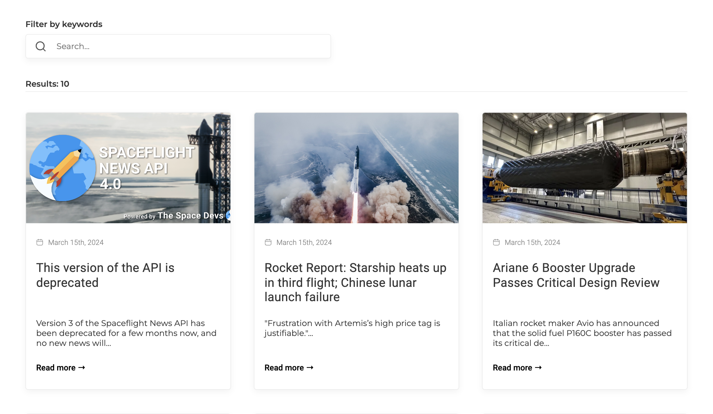
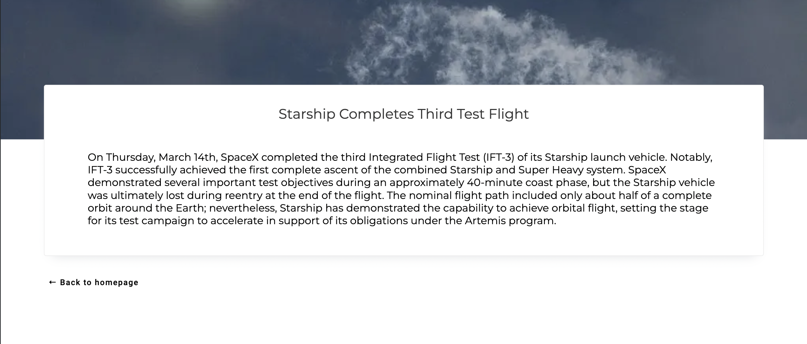

# News SPA with Angular

This project is a Single Page Application (SPA) built with Angular, using Angular Material for UI components. It fetches articles from the SpaceFlightNewsAPI and allows users to filter articles by keywords.

## Features

- Display a list of articles with titles and short descriptions.
- Click on an article card to navigate to a detail page with the full article description.
- Filter articles dynamically by entering keywords in a search bar.
- Highlight matched keywords in search results, prioritizing matches in article titles.

## Screenshots

_Home Page - List of Articles_

_Article Page_

## Technologies Used

- Angular
- Angular Material
- RxJS (for reactive programming)
- SCSS (CSS preprocessor)

## Development server

Run `ng serve` for a dev server. Navigate to `http://localhost:4200/`. The application will automatically reload if you change any of the source files.

### Usage

To interact with the Space News SPA, follow these steps:

1. **Browse Articles:**

   - Upon opening the application, you will land on the homepage displaying a list of articles.
   - Each article is represented by a card containing its title and a brief description (up to 100 characters).

2. **View Article Details:**

   - Click on any article card to navigate to its detailed description page.
   - The detailed page will display the full title and description of the selected article.

3. **Filter Articles:**
   - Use the search bar provided at the top of the homepage to filter articles by keywords.
   - Enter keywords related to article titles or descriptions into the search bar.
   - The system will display all articles that contain at least one of the entered keywords.
   - Matched keywords in article titles will be highlighted in yellow for easy identification.

### API Reference

This project utilizes the SpaceFlightNewsAPI to fetch articles dynamically. Below is the link to the SpaceFlightNewsAPI documentation for further details:

- [SpaceFlightNewsAPI Documentation](https://spaceflightnewsapi.net/)

### Contact
Project Link: [https://my-angular-news-app.netlify.app/](https://my-angular-news-app.netlify.app/)
